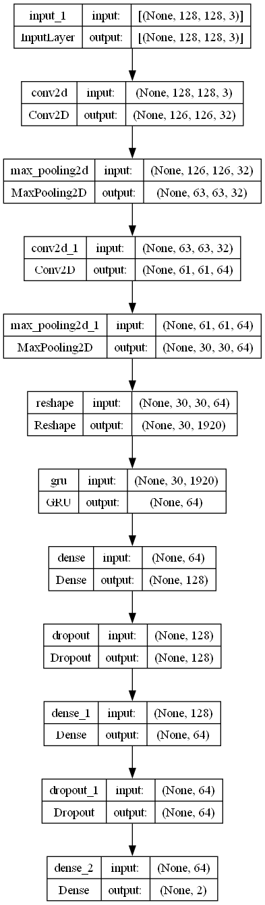
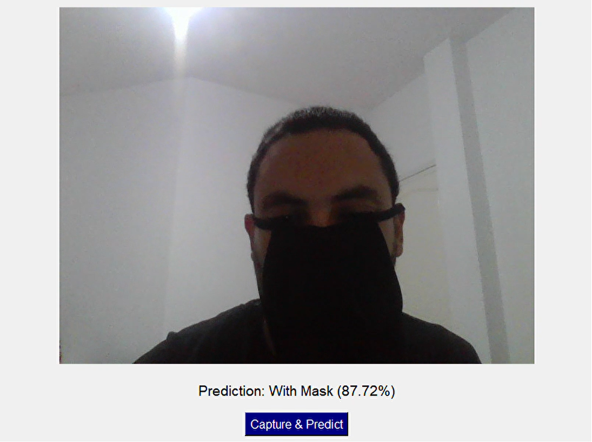

# 😷 Mask Detection Model

## 📌 Project Overview
This project builds a **deep learning model** to detect whether a person is wearing a face mask, using a **CNN-GRU** architecture for binary classification (**With Mask** or **Without Mask**). It includes data preprocessing, model training, evaluation, manual image testing, and a real-time Tkinter app for webcam detection. The model achieves a test accuracy of ~94%.

---

## 📂 Dataset
- **Face Mask Dataset**: From Kaggle, with 3725 "with_mask" and 3828 "without_mask" images.  
  🔗 [Face Mask Dataset](https://www.kaggle.com/datasets/omkargurav/face-mask-dataset)

---

## 🔍 Project Workflow

### **1. Loading and Labeling Data**
Load images and assign labels (1 for with mask, 0 for without).

```python
import os
import numpy as np
from PIL import Image

with_mask_files = os.listdir('data/with_mask')
without_mask_files = os.listdir('data/without_mask')

with_mask_label = [1] * len(with_mask_files)
without_mask_label = [0] * len(without_mask_files)
labels = with_mask_label + without_mask_label
```

### **2. Image Processing**
Resize images to 128x128, convert to RGB, and normalize.

```python
data = []
for img_file in with_mask_files:
    image = Image.open('data/with_mask/' + img_file).resize((128, 128)).convert('RGB')
    data.append(np.array(image))
for img_file in without_mask_files:
    image = Image.open('data/without_mask/' + img_file).resize((128, 128)).convert('RGB')
    data.append(np.array(image))

X = np.array(data) / 255.0
Y = np.array(labels)
```

### **3. Model Training**
Train a CNN-GRU model with early stopping.

```python
from tensorflow import keras
from tensorflow.keras import layers
from sklearn.model_selection import train_test_split

X_train, X_test, Y_train, Y_test = train_test_split(X, Y, test_size=0.2, random_state=2)

model = keras.Sequential([
    layers.Input(shape=(128, 128, 3)),
    layers.Conv2D(32, (3, 3), activation='relu'),
    layers.MaxPooling2D((2, 2)),
    layers.Conv2D(64, (3, 3), activation='relu'),
    layers.MaxPooling2D((2, 2)),
    layers.Reshape((30, 30 * 64)),
    layers.GRU(64),
    layers.Dense(128, activation='relu'),
    layers.Dropout(0.5),
    layers.Dense(64, activation='relu'),
    layers.Dropout(0.5),
    layers.Dense(2, activation='sigmoid')
])

model.compile(optimizer='adam', loss='sparse_categorical_crossentropy', metrics=['acc'])
model.fit(X_train, Y_train, validation_split=0.1, epochs=20, callbacks=[keras.callbacks.EarlyStopping(patience=3)])
model.save("mask_detection_model.keras")
```

### **4. Model Evaluation**
Evaluate and plot training history.

```python
import matplotlib.pyplot as plt

loss, accuracy = model.evaluate(X_test, Y_test)
print('Test accuracy =', accuracy)

plt.plot(history.history['loss'], label='train loss')
plt.plot(history.history['val_loss'], label='validation loss')
plt.legend()
plt.savefig('loss_plot.png')
plt.close()

plt.plot(history.history['acc'], label='train accuracy')
plt.plot(history.history['val_acc'], label='validation accuracy')
plt.legend()
plt.savefig('accuracy_plot.png')
plt.close()
```

### **5. Manual Testing**
Predict on a single image.

```python
from tensorflow import keras
from PIL import Image
import numpy as np

model = keras.models.load_model("mask_detection_model.keras")
img = Image.open("test.jpg").resize((128, 128)).convert('RGB')
img_array = np.array(img) / 255.0
img_array = img_array.reshape(1, 128, 128, 3)
prediction = model.predict(img_array)
class_names = ["without mask", "😷 with mask"]
print(f"The person is: {class_names[np.argmax(prediction)]}")
```

### **6. Real-Time Detection**
Run a Tkinter app for webcam-based detection.

```python
import tkinter as tk
from PIL import Image, ImageTk
import cv2
import numpy as np
import tensorflow as tf

class MaskDetectionApp:
    def __init__(self, root):
        self.root = root
        self.root.title("Real-Time Mask Detection")
        self.model = tf.keras.models.load_model("mask_detection_model.keras")
        self.cap = cv2.VideoCapture(0)
        self.label = tk.Label(self.root)
        self.label.pack(pady=10)
        self.result_label = tk.Label(self.root, text="Prediction: None", font=("Arial", 14))
        self.result_label.pack(pady=10)
        tk.Button(self.root, text="Capture & Predict", command=self.capture_and_predict).pack(pady=5)
        tk.Button(self.root, text="Exit", command=self.exit_app).pack(pady=5)
        self.running = True
        self.update_frame()

    def update_frame(self):
        if self.running:
            ret, frame = self.cap.read()
            if ret:
                frame_rgb = cv2.cvtColor(frame, cv2.COLOR_BGR2RGB)
                frame_resized = cv2.resize(frame_rgb, (640, 480))
                img = Image.fromarray(frame_resized)
                imgtk = ImageTk.PhotoImage(image=img)
                self.label.imgtk = imgtk
                self.label.configure(image=imgtk)
            self.root.after(10, self.update_frame)

    def capture_and_predict(self):
        ret, frame = self.cap.read()
        if ret:
            img = cv2.cvtColor(frame, cv2.COLOR_BGR2RGB)
            img = cv2.resize(img, (128, 128))
            img = np.array(img) / 255.0
            img = np.expand_dims(img, axis=0)
            prediction = self.model.predict(img)
            result = "With Mask" if np.argmax(prediction[0]) == 1 else "Without Mask"
            self.result_label.config(text=f"Prediction: {result}")

    def exit_app(self):
        self.running = False
        self.cap.release()
        self.root.quit()

if __name__ == "__main__":
    root = tk.Tk()
    app = MaskDetectionApp(root)
    root.mainloop()
```

---

## 📊 Model Results
- **Model Architecture**: 
- **Test Accuracy**: 0.9398 (~94%)
- **Tkinter App Test**: 

---

## 📦 Requirements
```bash
pip install numpy matplotlib opencv-python pillow scikit-learn tensorflow keras
```

---

## ▶️ How to Run
1. Clone the repository:
   ```bash
   git clone https://github.com/yourusername/mask-detection.git
   cd mask-detection
   ```
2. Download the dataset from Kaggle and place it in `data/`.
3. Install dependencies.
4. Train the model with your own dataset. 
5. Test it.

---

## 📌 Key Insights
- The **CNN-GRU model** achieves ~94% accuracy by combining spatial feature extraction with sequential processing.
- Image preprocessing (resizing, normalization) ensures robust performance.
- The Tkinter app enables real-time mask detection with webcam input.
- Dropout layers (0.5) reduce overfitting, as shown in training plots.
- Balanced dataset (similar counts for both classes) supports reliable classification.

---

## 📜 License
MIT License
